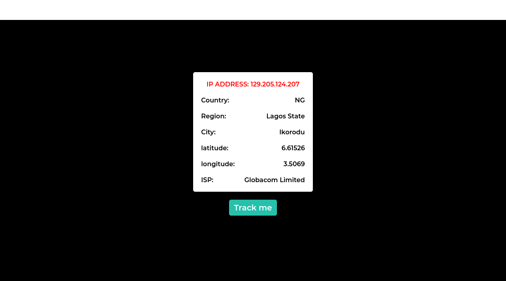

# ip-Tracker

## Table of contents

- [Overview](#overview)
  - [The goal](#the-goal)
  - [Screenshot](#screenshot)
  - [Links](#links)
- [My process](#my-process)
  - [Built with](#built-with)
  - [What I learned](#what-i-learned)
- [Author](#author)

## Overview

Api's are very important part of a frontend developer job, most of the time as a FE dev you are speaking to various api in one project or the other. Learning about Api's, i decided to use what i've learnt so far to build a web based ip tracker using [ipify](https://ipify.org) public Api. 

### The goal

Users should be able to:

- View their ip address and some geographical details 

### Screenshot



### Links

- [solution URL](https://your-solution-url.com)
- [live site URL]( https://clefayomide.github.io/ip-tracker)

## My process

### Built with

- HTML5
- CSS
- Fetch Api
- [Vanilla JavaScript](https://www.javascript.com/)
- Mobile-first workflow

### What I learned

While building this project, i learnt how to convert a variable from a local scope to a global scope. I had the need to concatenate the ip address gotten from the first fetch call to the second fetch address as a query for the geographical details. The variable that contained the ip address to be concatenated was in a local scope, in order to be able to call that variable outside of it's scope, it needs to be converted to a global variable.
```js
let window.variableName = variableName
```

## Author

- Twitter - [@olorunfemivic18](https://www.twitter.com/olorunfemivic18)